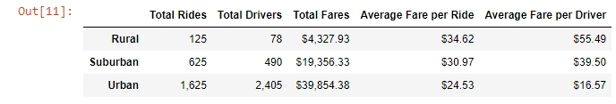
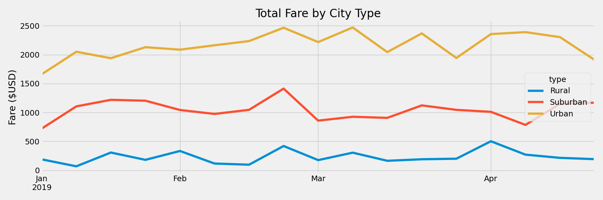
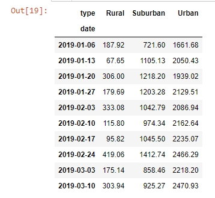

# PyBer Analysis
## Overview
The purpose of this analysis was to illustrate, in graph, weekly total ride fares based on city types (urban, suburban, and rural).

## Resources
1. Python 3.7.14
2. Jupyter Notebook 5.7.10

## Results
The total number of rides, drivers, and fares were highest in urban cities, then suburban, then rural as shown in below table. 
However, the average fare per ride and per driver showed the opposite trend, with rural cities being more profitable than those of urban and suburban cities. 

 
 

As determined by above chart, urban cities had the most number of rides and drivers, and therefore fares. Below line graph illustrates the total fare amounts on a weekly basis from January, 2019 to April, 2019, with the highest peak the last week of February across all city types.

 
 

## Summary
### Recommendations for the Business

As previously shown in the fare summary table, you can see that the number of rides in suburban and rural areas outnumber the number of drivers while drivers outnumbered the number of rides in urban cities. From this data, one suggestion for the business is to increase the number of drivers in suburban/rural areas, which could potentially lead to higher number of rides as well. Another suggestion is to increase marketing in urban areas. Since there are more drivers than rides provided, about a third of the drivers may not have had any rides to generate sales. With more rides, there will be more higher total fares, resulting in higher fare per driver, making it more attractive for drivers to continue with their job. Lastly, PyBer may limit the number of drivers in the urban area, since there seems to be more drivers than needed. This will help to increase the average fare per driver while ensuring there aren't too much loss in manpower.